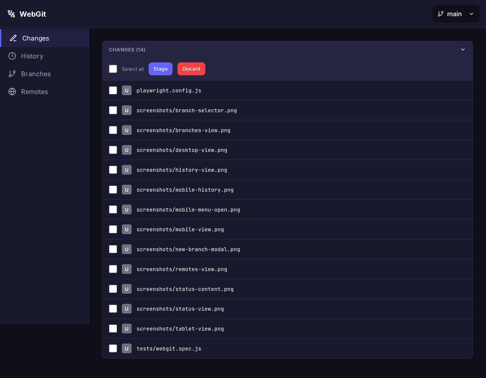
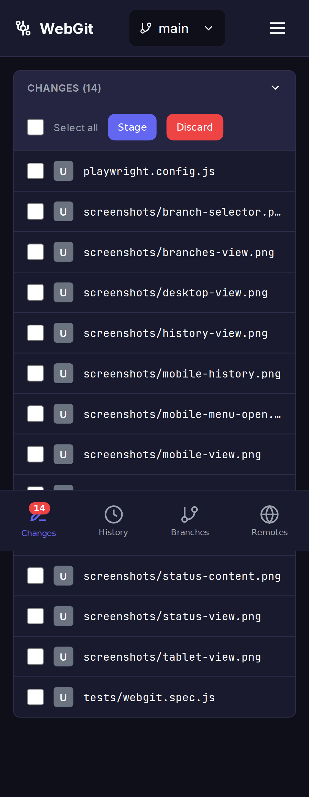
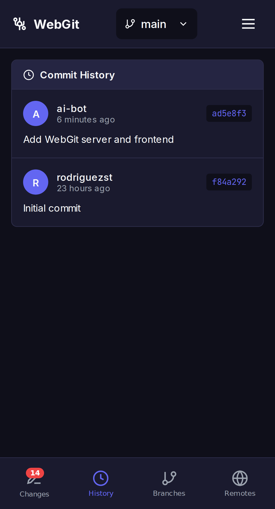
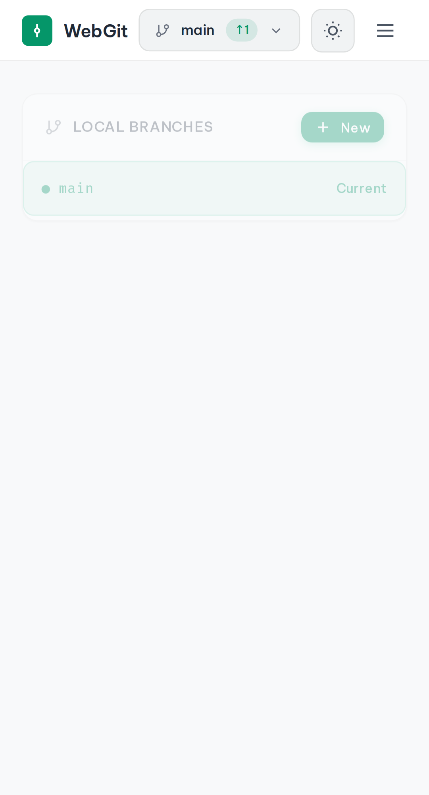
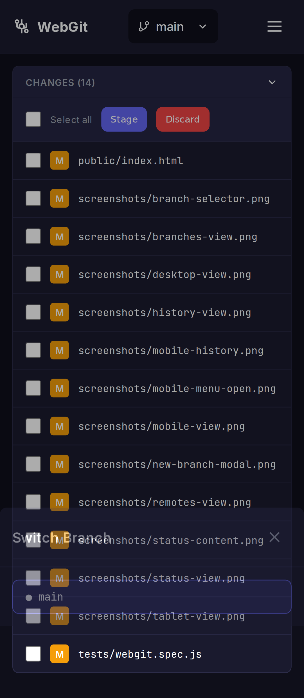
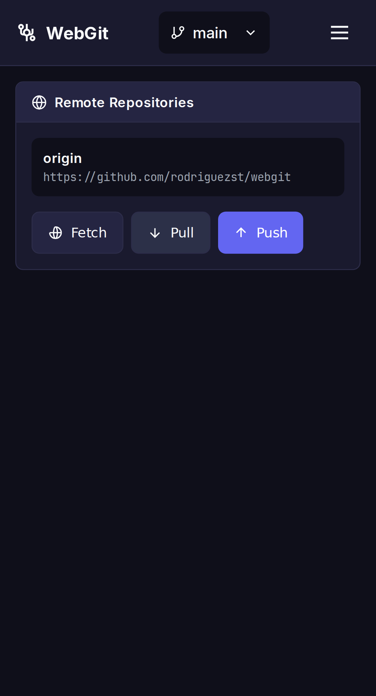
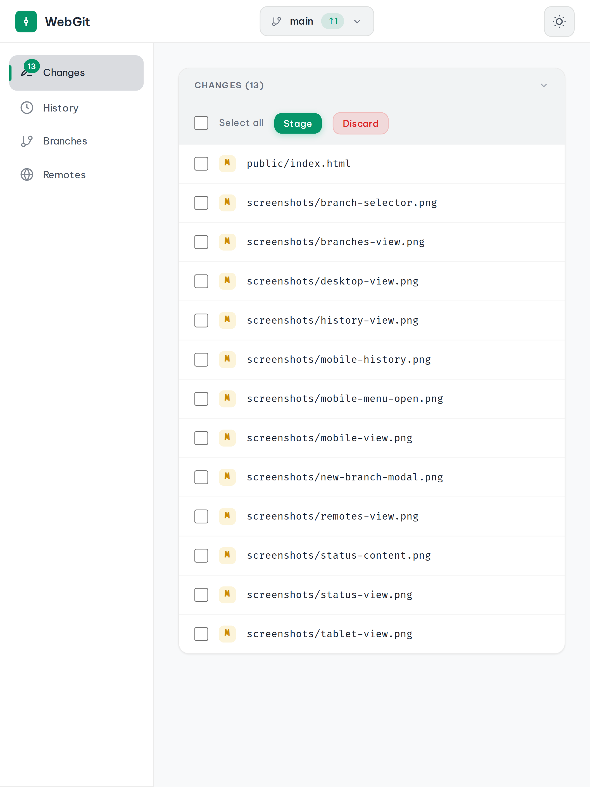
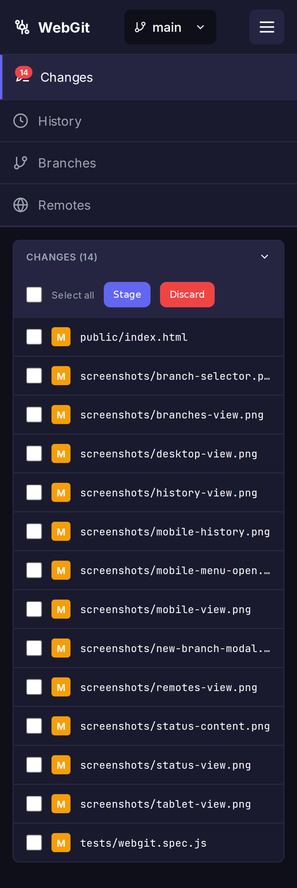

# WebGit

A standalone, lightweight Git web viewer that can be launched from any git repository directory to provide a comprehensive git management experience through a web browser.

## Features

- **Repository Status Dashboard** - View modified, added, deleted, and untracked files with visual indicators
- **Diff Viewer** - Side-by-side or unified diff views with syntax highlighting
- **Staging & Committing** - Selective file staging with checkbox selection and commit interface
- **Branch Management** - Create, switch, and delete branches with an intuitive UI
- **Commit History** - Browse commits with author info, dates, and messages
- **Remote Operations** - Fetch, pull, and push with visual sync status indicators
- **Mobile-First Responsive Design** - Works seamlessly on desktop, tablet, and mobile devices

## Screenshots

### Desktop View


### Mobile View


### Commit History


### Branch Management


### Branch Selector


### Remote Operations


### Tablet View


### Mobile Menu


## Installation

```bash
# Clone the repository
git clone https://github.com/rodriguezst/webgit.git
cd webgit

# Install dependencies
npm install
```

## Usage

### Basic Usage

Launch WebGit from any git repository:

```bash
# Navigate to your git repository
cd /path/to/your/repo

# Start WebGit (pointing to current directory)
REPO_PATH=$(pwd) npx webgit

# Or run from the webgit directory
cd /path/to/webgit
REPO_PATH=/path/to/your/repo npm start
```

### Configuration

WebGit can be configured using environment variables:

| Variable | Default | Description |
|----------|---------|-------------|
| `PORT` | `3000` | Port to run the server on |
| `REPO_PATH` | `process.cwd()` | Path to the git repository |

### Examples

```bash
# Run on a different port
PORT=8080 npm start

# Run for a specific repository
REPO_PATH=/home/user/myproject npm start

# Development mode with auto-reload
npm run dev
```

## API Endpoints

WebGit exposes a REST API for git operations:

| Endpoint | Method | Description |
|----------|--------|-------------|
| `/api/status` | GET | Get repository status |
| `/api/branches` | GET | List all branches |
| `/api/branches` | POST | Create a new branch |
| `/api/branches/checkout` | POST | Checkout a branch |
| `/api/branches/:name` | DELETE | Delete a branch |
| `/api/commits` | GET | Get commit history |
| `/api/commits/:hash` | GET | Get commit details |
| `/api/diff` | GET | Get diff for a file |
| `/api/stage` | POST | Stage files |
| `/api/unstage` | POST | Unstage files |
| `/api/commit` | POST | Create a commit |
| `/api/discard` | POST | Discard changes |
| `/api/remotes` | GET | List remotes |
| `/api/fetch` | POST | Fetch from remote |
| `/api/pull` | POST | Pull from remote |
| `/api/push` | POST | Push to remote |
| `/api/config` | GET/POST | Get/set git config |

## Testing

WebGit includes comprehensive Playwright tests:

```bash
# Run all tests
npm test

# Run tests with UI
npm run test:ui

# Run specific project
npx playwright test --project=chromium
npx playwright test --project=mobile
```

## Tech Stack

- **Backend**: Node.js, Express.js
- **Git Operations**: simple-git
- **Frontend**: Vanilla JavaScript, CSS (Mobile-first)
- **Testing**: Playwright

## Keyboard Shortcuts

| Shortcut | Action |
|----------|--------|
| `Ctrl+Enter` | Commit (when in commit message field) |
| `Escape` | Close modals |
| `R` | Refresh current view |

## Browser Support

WebGit is tested and works on:
- Chrome/Chromium (Desktop & Mobile)
- Firefox
- Safari
- Edge

## License

MIT License - see [LICENSE](LICENSE) for details.
